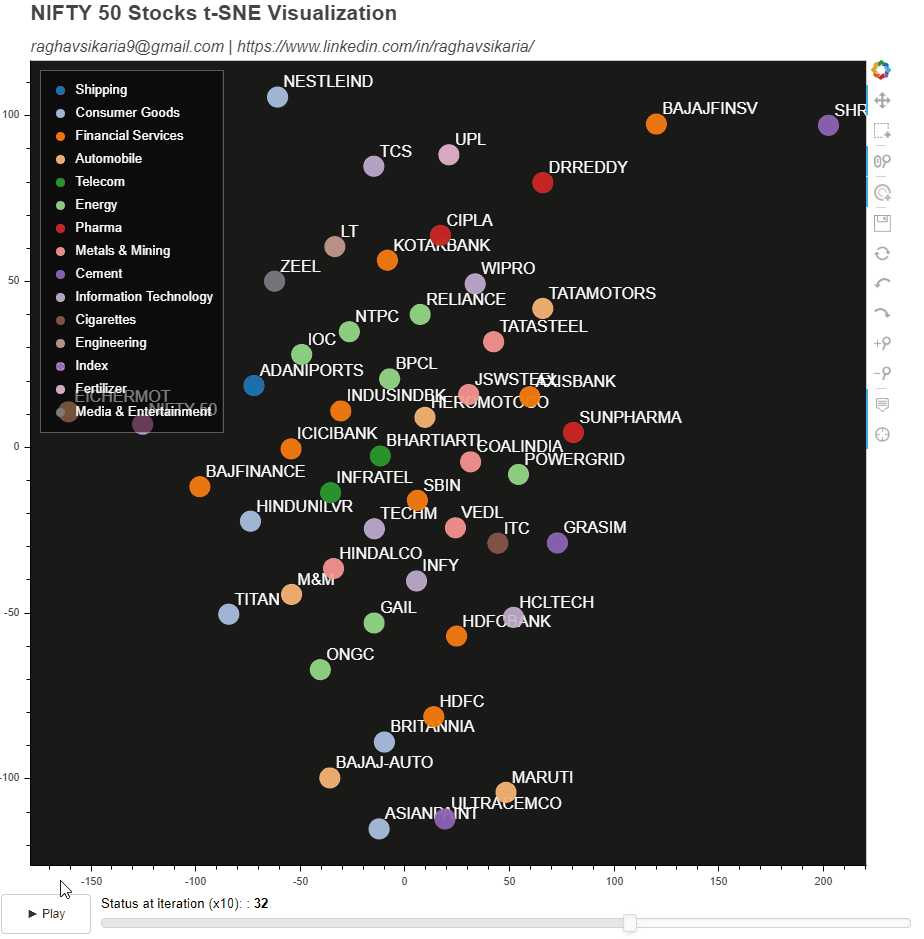
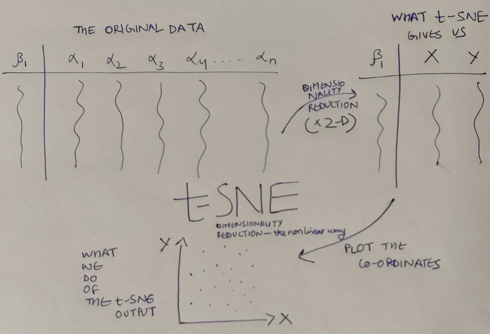

# Applying t-SNE to NIFTY50 Stock Day snapshot and visualizing all iterations using Bokeh(Python) - JSCallBacks & User Interactivity

TL;DR - This is what this article/mini-project attempts to achieve:




## Objective

+ Apply t-SNE to NIFTY 50 Stocks data 
+ To make a plot such that:
    + It visualises all t-SNE Iterations applied to NIFTY 50 Stocks data
    + Provides interactivity the user in the form of:
        + Surfing between iterations by mechanism of a slider
        + Playing the iterations in action using Play/Pause toggle buttons
        + Giving the user option to alter, save the plot and other basic functionalities (zoom,pan,select,etc)


## What is t-SNE?
It is a quite recent(2008), non-linear dimensionality reduction algorithm given by Laurens van der Maaten and the Godfather of Deep Learning - Geoffrey Hinton. In these past few years it has proven to be _the_ tool for high dimensional data exploratory analysis and visualizations. Now I could go on paraphrasing, but the fact is [this article by Analytics Vidya](https://www.analyticsvidhya.com/blog/2017/01/t-sne-implementation-r-python/) is the single best resource I've ever come across for t-SNE. So you can refer to that for learning more.
In a nutshell it will do this:




## The Process
In the [repository](https://github.com/thepirhana/t-SNE-Visualization-on-NIFTY50) you can begin reading the code from **if __name__ == "__main__":** (verbatim)
1. So I began with collecting data from [NSEIndia](https://www1.nseindia.com/live_market/dynaContent/live_watch/equities_stock_watch.htm) and took a snaphot of 3rd April 2020 for NIFTY 50 Stocks.
1. Added all sectors to the data manually to have color encoding in the plot sector-wise. Data looks like this(first few rows):

|Sector|Symbol|Open|High|Low|Last Traded Price|Change|%Change|Traded Volume(lacs)|Traded Value(crs)|52 Week High|52 Week Low|365 Days % Change|30 Days % Change|
|:---:|:---:|:---:|:---:|:---:|:---:|:---:|:---:|:---:|:---:|:---:|:---:|:---:|:---:|
|Shipping|ADANIPORTS|246|252.8|238.9|244.2|-0.6|-0.25|72.1|179.14|430.6|203|-35.69|-28.31|
|Consumer Goods|ASIANPAINT|1615.1|1616|1517.25|1522|-81.2|-5.06|29.26|449.42|1916.7|1291.25|0.18|-14.82|
|Financial Services|AXISBANK|360.2|362.3|324|326.9|-31.75|-8.85|413.18|1417.61|827.75|286|-57.4|-52.22|
|Automobile|BAJAJ-AUTO|2051.1|2056.3|1957.55|2020|-31.1|-1.52|6.92|139.21|	3315.15|1788.65|-29.2|-27.66|
|Financial Services|BAJAJFINSV|4560|4646|4430|4520.05|18.15|0.4|7.22|327.73|9950|4160.25|-37.91|-49.3|

3. Now we just need to apply t-SNE to this to reduce the data to 2-Dimensions - X and Y coordinates and plot them. But the challenge here is that we need to capture these coordinates for every iteration that t-SNE goes through, and **sklearn** - the library that gives us the t-SNE function in Python; only gives us the final iteration set of coordinates for each data row. To fix this up, enters this [beautiful article by Oreilly](https://www.oreilly.com/content/an-illustrated-introduction-to-the-t-sne-algorithm/) which teaches us how to do so.
1. The solution is to monkey-patch the source code of the _gradient_descent() function provided by this library. Monkey Patching = Altering the original source code of the imported library(sklearn in this case) to achieve your desired functionality which in our case is to capture set of (X,Y) Coordinates for all iterations.
1. Then there's always the issue of working with different library versions - we need to fix our monkey-patch for different versions. My sklearn's version is _0.22.1_, which is different from the Oreilly's version (0.15). So essentially, most of the versions post 0.15 will work by monkey patching this way:
```python
sklearn.manifold._t_sne._gradient_descent = _gradient_descent

# instead of 
# sklearn.manifold.t_sne._gradient_descent = _gradient_descent
# which worked for 0.15 version

# Now the technical reasons for this are a bit complex, (for fellow coders)have a look at the code in repository and it will occur to you and for the rest - ignore!!
```

### Giving Life to Plot
Now that we have all data from t-SNE we just need to process it and feed into our Plot. We'll achieve the functionality of Play/Pause Toggle and Slider by using 2 independent Custom JSCallBacks in Bokeh.

1. We first need to declare and initialize our plot:
```python
    # INITIALIZING FIGURES
    p = figure(plot_width=PLOTWIDTH, plot_height=PLOTHEIGHT, tooltips=TOOLTIPS,tools=BOKEH_TOOLS, toolbar_location='right')

    # GIVING TITLES TO OUR PLOT
    p.add_layout(Title(text="NIFTY 50 Stocks t-SNE Visualization", text_font_size="16pt"), 'above')
    p.title.text_font_size = '20pt'

    # GIVING BACKGROUND COLOR TO OUR PLOT
    p.background_fill_color = "black"
    p.background_fill_alpha = 0.9

    # DELETING GRIDLINES FROM PLOT
    p.xgrid.grid_line_color = None
    p.ygrid.grid_line_color = None

    # GIVING COLOR TO OUR PLOT AND ENCODING VIA SECTORS THE COMPANIES BELONG TO
    no_of_colors = len(df_nifty_tsne['sector'].unique())
    palette = d3['Category20'][no_of_colors]
    factors_for_color_mapper = df_nifty_tsne['sector'].unique()
    color_mapper = CategoricalColorMapper(factors=factors_for_color_mapper, palette=palette)

    # PLOTTING ALL COMPANIES AS CIRCLE MARKERS WITH THEIR NAMES
    p.circle(x='x',y='y',source=sliceCDS,legend='sector',color={'field': 'sector', 'transform': color_mapper},size=20,alpha=0.9)
    company_label = LabelSet(x='x', y='y', text='label', level='glyph',x_offset=6, y_offset=6, source=sliceCDS, render_mode='canvas',text_color='white')
    p.add_layout(company_label)

    # GIVING LEGEND SPECIFICATIONS
    p.legend.location = 'top_left'
    p.legend.background_fill_alpha = 0.5
    p.legend.background_fill_color = 'black'
    p.legend.label_text_color = 'white'
    p.legend.click_policy = 'mute'
```

2. Then we'll functionalities to it:
```python
    ## CREATING A SLIDER FOR PLOT AND VIEWING TSNE ITERATIONS
    # SLIDER CALLBACK CUSTOM JS
    SliderCallback = CustomJS(args = dict(sliceCDS=sliceCDS, fullCDS=fullCDS, indexCDS=indexCDS), code = """
        const new_value = cb_obj.value;
        
        // Take the 'Slice' column from the full data
        const slice_col = fullCDS.data['Slice'];

        // Select only the values equal to the new slice number
        const mask = slice_col.map((item) => item==new_value);
        
        sliceCDS.data['y'] = fullCDS.data['y'].filter((item,idx) => mask[idx]);
        sliceCDS.data['x'] = fullCDS.data['x'].filter((item,idx) => mask[idx]);
        sliceCDS.data['label'] = fullCDS.data['label'].filter((item,idx) => mask[idx]);

        // Update the sliceCDS
        sliceCDS.change.emit();
        """)
    slider = Slider(title="Status at iteration (x10): ",start=0, end=49,value=0,step=1, height=40, width=int(PLOTWIDTH*0.9))
    slider.js_on_change('value', SliderCallback)
```

3. And consolidate the plot by:
```python
    # ENCAPSULATING PLAY/PAUSE TOGGLER AND SLIDER
    widgets = row(toggler,slider, sizing_mode="fixed", height=40, width=PLOTWIDTH)

    # INTEGRATING WITH FINAL GRAPH
    final_graph = column(initializing_tsne_plot(df_nifty_tsne, sliceCDS, fullCDS, indexCDS),widgets)
    
    # SAVING THE FINAL GRAPH
    show(final_graph)
```

4. And like I mentioned the last time - there's always a but. Bokeh currently does not add the CDN import for Bokeh-API (known Issue) - which means the HTML code that it generates, simply forgets to the add the abovementioned import. Nevertheless, there's always a workaround, which is basically adding the import explictly by altering the generated HTML file:
```python
    with fileinput.FileInput(OUTPUT_HTML_FILE, inplace=True, backup='.bak') as file:
        for line in file:
            print(line.replace('1.4.0.min', '1.4.0'), end='')

    with open(OUTPUT_HTML_FILE) as f:
        code = f.readlines() 

    new_code = []
    for line in code:
        new_code.append(line)
        if 'bokeh-widgets-1.4.0' in line:
            new_code.append(BOKEH_API_CDN)

    with open(OUTPUT_HTML_FILE,'w') as f:
        f.writelines(new_code)
```

This was basically the gist of it. If you're up for it, let's collaborate over GitHub and make this better.

You can also reach out to me incase you have any queries pertaining to Bokeh or anything Python. Hope this helps!

## Acknowledgements
Expressing gratitude for all people associated with [Leveraged Growth](https://leveragedgrowth.in/) for motivating me to utilise the lockdown period and write this article and take up this project.

My sincere thanks to:
https://www1.nseindia.com for making this data available.

## References
+ https://www.oreilly.com/content/an-illustrated-introduction-to-the-t-sne-algorithm/
+ https://github.com/bokeh/bokeh/issues/6939
+ https://docs.bokeh.org/en/latest/docs/user_guide/categorical.html
+ https://github.com/bokeh/bokeh/issues/5112
+ https://docs.bokeh.org/en/latest/docs/user_guide/annotations.html
+ https://docs.bokeh.org/en/latest/docs/reference/models/glyphs/text.html
+ https://www1.nseindia.com/live_market/dynaContent/live_watch/equities_stock_watch.htm
+ https://docs.bokeh.org/en/latest/index.html
+ https://www.analyticsvidhya.com/blog/2017/01/t-sne-implementation-r-python/